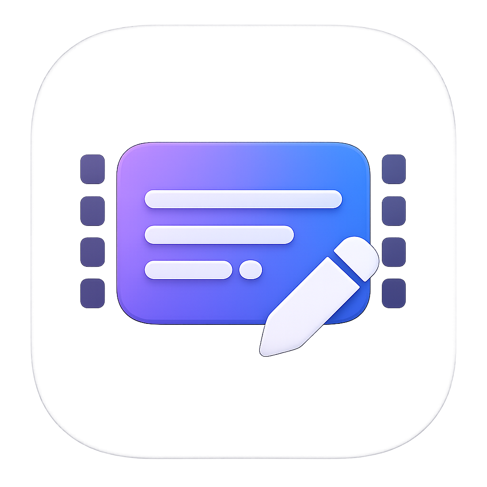

<div align="center">
  

  # Framelingo

  **Нативная macOS‑студия для создания, синхронизации и экспорта субтитров.**

  Превращайте видео в аккуратные субтитры локально — от распознавания речи<br>до таймлайна, разметки спикеров и готового MP4.

  [](https://www.apple.com/macos/)
  [](https://support.apple.com/116943)
  [](https://www.swift.org/)
  [](https://developer.apple.com/xcode/swiftui/)
</div>

---

## Возможности

| | |
|---|---|
| 🎙️ **Локальная транскрибация** | Whisper.cpp с VAD или Parakeet через FluidAudio — исходное видео не отправляется в облако |
| 👥 **Определение спикеров** | Диаризация, автоматическое сопоставление реплик и переименование участников |
| 🎞️ **Удобный таймлайн** | Волновая форма, масштабирование, точная настройка границ реплик и синхронное воспроизведение |
| ✍️ **Редактор субтитров** | Исходный и переводной текст, предупреждения о таймингах, undo/redo и несколько режимов рабочего пространства |
| ✂️ **Монтаж без разрушения исходника** | Виртуальные разрезы и обрезка видео с автоматическим пересчётом субтитров |
| 📤 **Гибкий экспорт** | SRT, WebVTT и TXT, подписи спикеров, а также MP4 со встроенными субтитрами |
| 🎨 **Оформление видео** | Шрифт, цвета, фон, рамка, позиция, разрешение, FPS, кодек и качество экспорта |
| 📥 **Импорт субтитров** | SRT, VTT, ASS, SSA, TXT и SBV с предпросмотром перед добавлением в проект |
| 💾 **Файлы проектов** | Сохранение и повторное открытие проектов в формате `.subtitleedit` |

## Как это работает

```text
Видео → извлечение аудио → распознавание речи → определение спикеров
      → редактура и синхронизация → экспорт субтитров или готового видео
```

1. Перетащите в Framelingo файл `MP4`, `MOV`, `M4V`, `WEBM` или `MKV`.
2. Выберите локальный движок распознавания и установите модель в **Settings → Tools**.
3. Запустите транскрибацию, проверьте текст и таймкоды на таймлайне.
4. При необходимости переименуйте спикеров, импортируйте перевод или отредактируйте видео.
5. Экспортируйте отдельные субтитры либо MP4 с уже встроенным оформлением.

> [!NOTE]
> Распознавание и обработка медиа выполняются на Mac. Интернет нужен при первой загрузке моделей и для проверки обновлений приложения.

## Системные требования

- Mac с процессором Apple Silicon (`arm64`)
- macOS 15.6 или новее
- Xcode 26.3 или совместимая более новая версия — только для сборки из исходников
- Свободное место для моделей: комплект Parakeet занимает примерно 1 ГБ; размер Whisper зависит от выбранной модели

## Установка

### Готовая сборка

Подписанные и нотариально заверенные архивы публикуются в [Framelingo Releases](https://github.com/iosdevsx/Framelingo-releases/tree/main/releases). Скачайте актуальный ZIP, перенесите `Framelingo.app` в папку `Applications` и запустите приложение.

Дальнейшие обновления устанавливаются через встроенный механизм Sparkle — проверку можно запустить вручную из меню приложения.

### Сборка из исходников

```bash
git clone https://github.com/iosdevsx/Framelingo.git
cd Framelingo
open Framelingo.xcodeproj
```

В Xcode выберите схему **Framelingo** и запустите проект клавишами `⌘R`. Зависимости FluidAudio и Sparkle загрузятся через Swift Package Manager автоматически. FFmpegKit и arm64‑сборка `whisper-cli` уже находятся в репозитории.

Собрать проект из терминала можно так:

```bash
xcodebuild \
  -project Framelingo.xcodeproj \
  -scheme Framelingo \
  -destination 'platform=macOS,arch=arm64' \
  build
```

## Локальные модели

Framelingo поддерживает два движка распознавания:

- **Whisper.cpp** — универсальный мультиязычный вариант. Исполняемый файл встроен в приложение, а выбранная модель и опциональная Silero VAD загружаются из настроек.
- **Parakeet** — быстрый движок FluidAudio для 25 европейских языков, включая русский, английский, украинский, немецкий, французский и испанский. Для неподдерживаемого языка приложение может использовать установленный Whisper.

Модели сохраняются локально в каталогах Application Support и кэша FluidAudio. Их не нужно загружать повторно при каждом запуске.

## Форматы

| Назначение | Поддерживаемые форматы |
|---|---|
| Входное видео | MP4, MOV, M4V, WEBM, MKV |
| Импорт субтитров | SRT, VTT, ASS, SSA, TXT, SBV |
| Экспорт субтитров | SRT, WebVTT, TXT |
| Экспорт видео | MP4, H.264 |
| Файл проекта | `.subtitleedit` |

## Технологии

- **SwiftUI + AppKit + AVFoundation** — интерфейс и воспроизведение видео
- **whisper.cpp** — локальное мультиязычное распознавание речи
- **FluidAudio / Parakeet** — ASR и диаризация спикеров
- **FFmpegKit** — подготовка аудио и рендеринг итогового видео
- **Sparkle** — безопасные автоматические обновления
- **XCTest** — модульные тесты таймлайна, импорта, распознавания и экспорта

## Структура проекта

```text
Framelingo/
├── App/                  # состояние приложения
├── Models/               # проекты, субтитры, спикеры и настройки
├── Views/                # SwiftUI-интерфейс
├── ViewModels/           # логика экранов
├── SpeechToText/         # Whisper и Parakeet
├── SpeakerDiarization/   # определение и выравнивание спикеров
├── Timeline/             # таймлайны субтитров и монтажа
├── Import/               # импорт файлов субтитров
├── Export/               # экспорт SRT, VTT, TXT и ASS для рендеринга
└── Media/                # FFmpeg, метаданные и волновая форма

FramelingoTests/          # модульные тесты
BundledTools/Whisper/     # встроенный whisper-cli и библиотеки
External/FFmpegKit/       # встроенные FFmpeg-фреймворки
Scripts/                  # сборка инструментов и публикация релиза
```

## Тесты

```bash
xcodebuild test \
  -project Framelingo.xcodeproj \
  -scheme Framelingo \
  -destination 'platform=macOS,arch=arm64'
```

## Текущее состояние

Framelingo активно развивается. Локальные распознавание, диаризация, редактирование, импорт и экспорт реализованы; провайдер автоматического перевода пока демонстрационный. Переводной текст можно редактировать вручную или импортировать из файла субтитров.

---

<div align="center">
  Сделано для тех, кому нужен полный контроль над субтитрами — прямо на Mac.
</div>
